# Poffer Card Game

## Overview
Poffer is a strategic multiplayer card game implemented with client-server architecture using C++ and QT framework. Players compete in best-of-3 rounds to determine the winner.

## Game Components

### Card System
**Suits (Ranked)**:  
1. ♦ Diamond (Highest)  
2. 🏆 Gold  
3. 💵 Dollar  
4. 🪙 Coin (Lowest)  

**Card Values (per suit)**:  
🅱 Bitcoin (Highest) | ♔ King | ♕ Queen | ♗ Soldier | 10 → 2  

## Game Rules & Hand Rankings

### Pattern Hierarchy (Strongest to Weakest)

#### 10. Golden Hand 🌟
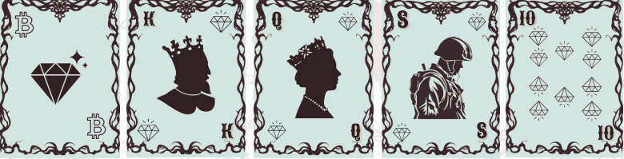
- **Composition**: Bitcoin + King + Queen + Soldier + 10 (same suit)
- **Tiebreaker**: Compare suit prestige (♦ > 🏆 > 💵 > 🪙)
- **Example**: All ♦ cards

#### 9. Order Hand 🔢
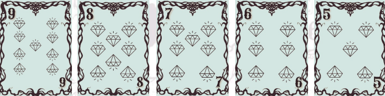
- **Composition**: 5 sequential same-suit cards
- **Tiebreaker**: Higher starting value → suit comparison

#### 8. 4+1 Hand 🃏
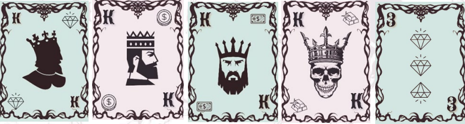
- **Composition**: Four-of-a-kind + kicker
- **Tiebreaker**: Compare quadruplet value

#### 7. Penthouse Hand 🏢
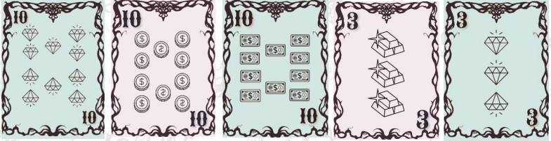
- **Composition**: Three-of-a-kind + pair
- **Tiebreaker**: Triplet value comparison

#### 6. MSC Hand (Flush) 💎
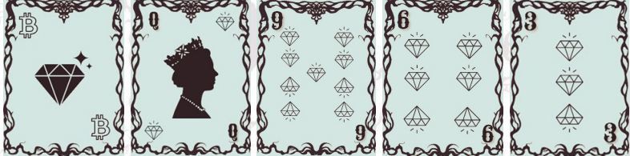
- **Composition**: 5 non-sequential same-suit cards
- **Tiebreaker**: Compare cards high-to-low

#### 5. Series (Straight) 📶
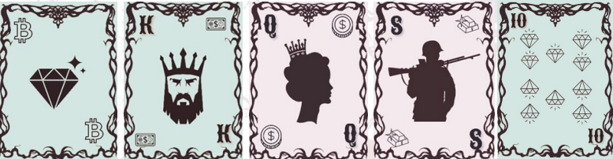
- **Composition**: 5 sequential mixed-suit cards
- **Tiebreaker**: Higher starting value

#### 4. 3+2 Hand 🎲
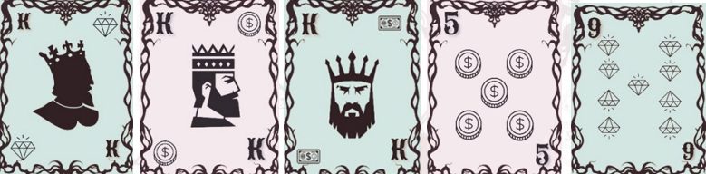
- **Composition**: Three-of-a-kind + two singles
- **Tiebreaker**: Triplet value comparison

#### 3. Double Pair 👥
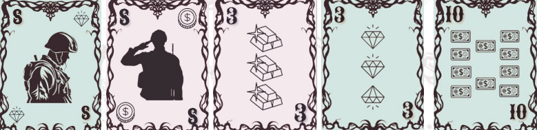
- **Composition**: Two pairs + kicker
- **Tiebreaker**: Compare higher pair → lower pair → kicker

#### 2. Single Pair 👤
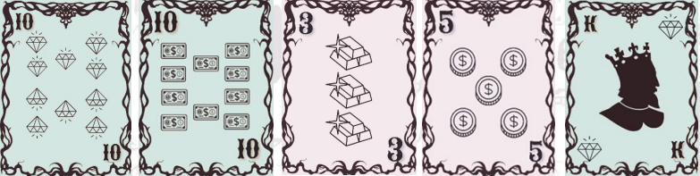
- **Composition**: One pair + three singles
- **Tiebreaker**: Pair value → kickers comparison

#### 1. Messy Hand 🌀
- **Composition**: No valid pattern
- **Tiebreaker**: High card comparison (value → suit)

## Game Flow
1. 🔀 Shuffle 52-card deck
2. 🎴 Starting player: Receives 7 → keeps 1 → passes 6
3. 🃏 Opponent: Selects 1 from 6
4. 🔁 Repeat 5x/round → 5 cards each
5. ⚖ Compare hands using pattern hierarchy
6. 🏆 First to win 2 rounds wins match (max 3)

## Card Visualizations

### Suit Examples
| ♦ Diamond | 🏆 Gold | 💵 Dollar | 🪙 Coin |

| 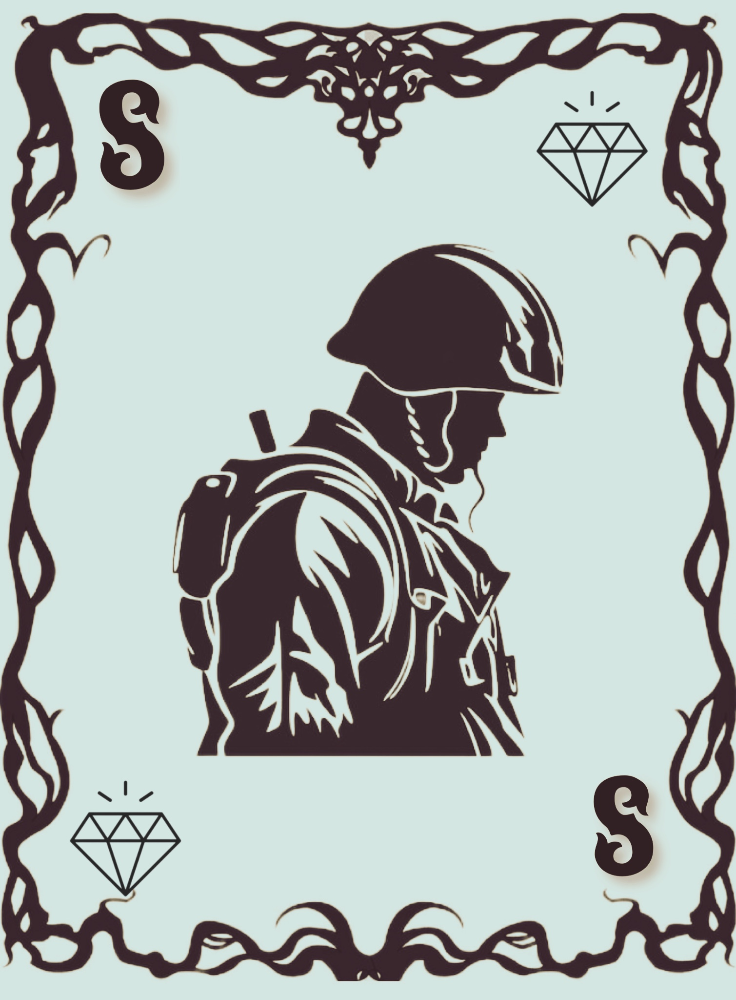 | 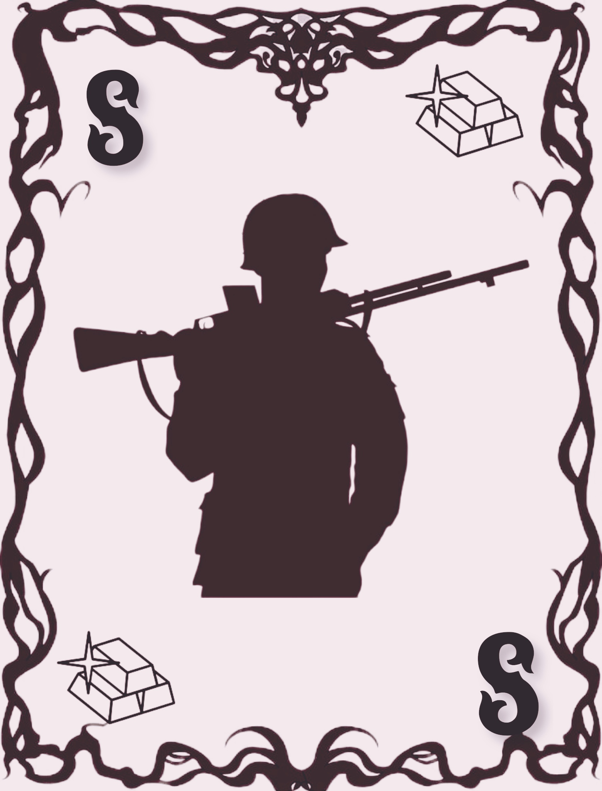 | 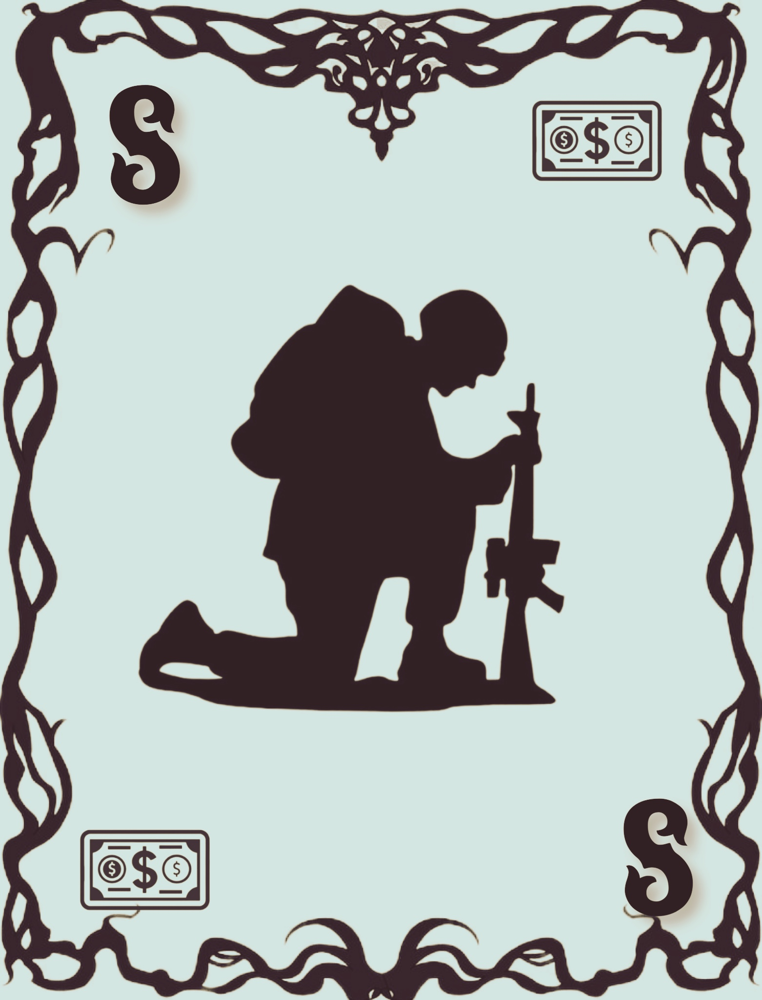 |  |

## Advanced Features
| Feature | Rules |
|---------|-------|
| 🔄 Card Exchange | 1 exchange/round (disabled in final phase) |
| ⏸️ Pause System | 2 pauses/game (max 20 sec each) |
| 📶 Disconnection | 60-sec reconnect window |
| ⏳ Inactivity | 20-sec timer → 10-sec warning → auto-penalty |

## Technical Implementation
- **Architecture**: Client-server model
- **Framework**: QT 6.5+
- **Concepts**: OOP, polymorphism, multi-threading, TCP sockets
- **Data**: STL containers, JSON serialization
